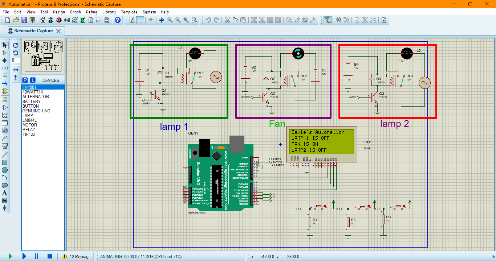

# ArduinoRF Home Automation

## Overview
ArduinoRF Home Automation is a project that enables remote control of home appliances using an Arduino and RF (Radio Frequency) signals. This system allows users to switch on and off two lamps and a fan wirelessly via RF transmitters and receivers. The project is implemented using a Proteus simulation.

## Project Image

*A complete setup of the ArduinoRF Home Automation system in Proteus simulation.*

## Features
- Remote switching of two lamps and a fan.
- Uses RF signals for wireless communication.
- Simple and efficient design with Arduino.
- Low power consumption.

## Components Required
- **Arduino Uno** (or any compatible microcontroller)
- **RF Transmitter & Receiver Module (433MHz)**
- **Relay Module (3-channel)**
- **Lamps (2)**
- **Fan**
- **Jumper wires**
- **Power supply**

## How It Works
1. The **RF Transmitter** sends signals based on user input.
2. The **RF Receiver** connected to the Arduino receives the signal.
3. The Arduino processes the signal and controls the **relay module**.
4. The relays switch the lamps and fan **ON/OFF** accordingly.

## Circuit Diagram
(TBD: Insert a diagram or link to a Fritzing file)

## Installation & Setup
1. Clone this repository:
   ```sh
   git clone https://github.com/sployal/ArduinoRF_home_automation
   ```
2. Open the Arduino IDE and upload the `ArduinoRF_home_automation.ino` sketch to your Arduino board.
3. Connect the hardware as per the circuit diagram.
4. Power up the system and test the remote functionality.

## Code
Find the full Arduino code in the `ArduinoRF_home_automation.ino` file.

## Usage
- Pressing the designated RF remote button will toggle the corresponding device.
- Each button corresponds to a specific lamp or fan.
- Ensure the RF modules are within range for optimal performance.

## Troubleshooting
- **No response from appliances?**
  - Check power connections.
  - Ensure RF modules are wired correctly.
- **Interference issues?**
  - Use a different frequency or antenna for better range.

## Future Enhancements
- Add smartphone control via Wi-Fi/Bluetooth.
- Implement voice control integration.
- Monitor device status using sensors.

## License
This project is open-source and licensed under the MIT License.

## Contributing
Feel free to fork, modify, and contribute to this project. Pull requests are welcome!

## Author
David muigai
